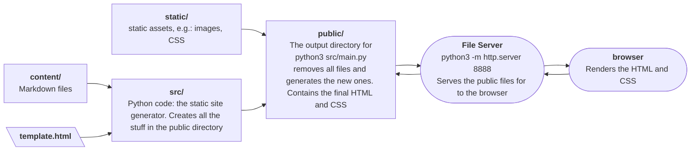

# static-site-py
## Architecture of the Static Site Project



## Nodes
> Intermediate representations of the markdown text elements inside our code during markdown to html conversion. 

### TextNode

Represents all the different types of *inline* text. The `TextNode` is an intermediate representation of the text in the python code. Inline text is any text which is part of a larger block of text. I.e.,

- Normal text
- `**Bold text**`
- `_Italic text_`
- \``Code text`\`
- Links, in the `[anchor text](url)` format
- Images, in `` format

Everything else is considered as a *block level*: e.g., headings, paragraphs, and bullet lists.

### HTMLNode

HTMLNode class represents a node in an HTML document tree, such as, `<p>` or `<a>` tags and their contents and can be either block-level of inline elements of the text. HTMLNode only outputs HTML.

### LeafNode

LeafNode is a type of HTMLNode. It is a leaf of HTML nodes with a single HTML tag with *no children*. E.g., a simple paragraph (tag `<p>` without any other nested tags):

```
<p>This is a paragraph.</p>
```

E.g., this paragraph is not a LeafNode:

```
<p> A paragraph with a <b>bold text</b>.</p>
```

where `<p>` is not a LeafNode. Here, the LeafNode is `<b>` tag.


